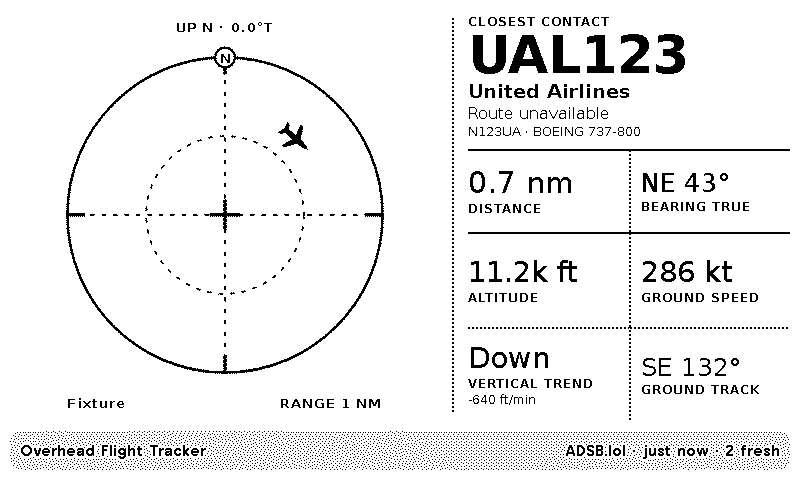

# TRMNL Overhead Flight Tracker

A current-format TRMNL polling plugin that plots the closest fresh, airborne
aircraft on a configurable radar scope centered on a latitude/longitude. It
refreshes on a requested 10-minute cadence and runs entirely in TRMNL's polling
plus hosted Python transform environment—no separate application server is required.

The provider chain is:

1. Flightradar24 Live Flight Positions Full, when an FR24 token is configured.
2. FlightAware AeroAPI v4 advanced flight search, when an AeroAPI key is configured.
3. ADSB.lol's public, ODbL-licensed point/radius endpoint as the credential-free fallback.

`FlightAware first` and `ADSB.lol only` modes are also available. Commercial
provider failures, rate limits, stale results, or empty results fall through to
the next source without breaking the display.

## Architecture

```text
TRMNL polling (ADSB.lol point/radius response)
                    |
                    v
          src/transform.py
          |  FR24 request (optional)
          |  FlightAware request (optional)
          |  already-fetched ADSB.lol fallback
          v
 provider-neutral nearest-aircraft object
                    |
                    v
 Liquid views: full / half horizontal / half vertical / quadrant
```

The open fallback is the polling URL rather than an extra transform request.
This makes fallback data available before either paid provider is attempted and
keeps FR24/FlightAware credentials out of the polling URL and headers. The
transform uses only Python's standard library, matching TRMNL's hosted
serverless convention.

No provider response is written to persistent storage by this project. Each
screen contains only the selected aircraft and small diagnostic metadata.

## Selection logic

- Request a bounding box from FR24 or FlightAware, or a point/radius result from ADSB.lol.
- Normalize every provider into the same fields and discard ground vehicles,
  missing positions, out-of-radius positions, and positions older than the
  configured maximum age.
- Calculate horizontal great-circle distance with the Haversine formula.
- Choose the smallest horizontal distance, with altitude used only as a stable tie-breaker.
- Calculate the initial bearing and 16-point compass direction from the
  configured location.
- Select the smallest enclosing scope range from 1, 2, 5, 10, 20, 50, 100,
  or 250 nautical miles and plot the contact in a normalized range-and-bearing view.
- Orient the target with true heading when available, otherwise use ground
  track. When neither is available, show a position dot instead of implying a direction.
- Fall through to the next provider if the current source errors or has no
  usable aircraft.

"Closest" therefore means closest horizontally to the configured point, not
smallest three-dimensional slant range. This is generally the most intuitive
interpretation of "overhead" and avoids treating a low, distant aircraft as
closer than one directly above.

## Radar scope and display fields

The 800×480 full view uses a 58/42 split between a self-contained vector radar
scope and a compact telemetry rail. The scope is north-up by default. The
`map_up_bearing_deg` setting changes the true bearing represented by the top of
the scope; the true-north marker remains upright and visible at every setting.
This is a range-and-bearing display, not a geographic basemap, and it makes no
map-service requests.



The rail shows flight/callsign, airline, route, aircraft name and ICAO type,
registration, numeric distance and bearing, altitude, ground speed, vertical
trend/rate, and the selected direction with its semantic label. Provider,
observation age, and fresh-candidate count appear in the title bar. Smaller
mashup views retain their previous hierarchy and consume the compatible
`heading_deg` and `heading_compass` aliases. A provider's long aircraft
description is used when present. A compact built-in lookup expands common
ICAO designators without making another API request; an unknown type still
falls back to its code.

## Configuration

| Setting | Required | Default | Notes |
| --- | --- | --- | --- |
| `latitude` | Yes | — | Decimal degrees, -90 to 90. |
| `longitude` | Yes | — | Decimal degrees, -180 to 180. |
| `location_label` | Yes | `Home` | Short display label. |
| `radius_nm` | Yes | `20` | 1–250 nautical miles. Smaller values reduce paid API cost and dense-airspace ambiguity. |
| `map_up_bearing_deg` | Yes | `0` | True bearing shown at the top of the full-view scope, from 0–359 degrees. `0` is north-up and `90` is east-up. |
| `max_age_minutes` | Yes | `5` | Reject older positions; allowed range 1–60. |
| `provider_order` | Yes | `auto` | FR24 first, FlightAware first, or ADSB.lol only. |
| `fr24_api_token` | No | blank | Paid Flightradar24 API token. |
| `flightaware_api_key` | No | blank | FlightAware AeroAPI v4 key. |
| `refresh_interval` | Project setting | `10` | Minutes, in `src/settings.yml`. See cadence caveat below. |

The API-key fields use TRMNL's `password` field type. They are delivered only
to the hosted transform and then to the provider's fixed HTTPS origin. Do not
put secrets directly in `.trmnlp.yml`; use environment variables for local work.

## Local verification

The fixture verification is offline and requires only Python 3.10+:

```bash
python3 -m unittest discover -s tests -v
python3 scripts/verify.py
```

The second command prints the exact provider-neutral JSON consumed by Liquid.

For a live TRMNL preview, install the official `trmnl_preview` gem or use
Docker through the included wrapper:

```bash
export TRACKER_LATITUDE="37.7749"
export TRACKER_LONGITUDE="-122.4194"
export TRACKER_LOCATION_LABEL="Home"
export TRACKER_RADIUS_NM="20"
export TRACKER_MAP_UP_BEARING_DEG="0"

# Optional paid sources:
export FR24_API_TOKEN="..."
export FLIGHTAWARE_AEROAPI_KEY="..."

./bin/trmnlp serve
```

Open `http://localhost:4567`. With no paid keys, the preview uses ADSB.lol.
You can also build static HTML (and PNGs when Firefox/ImageMagick are present):

```bash
./bin/trmnlp lint
./bin/trmnlp build
./bin/trmnlp build --png
```

## Deploy to TRMNL

The repository follows the current official `trmnlp` layout:

```text
src/settings.yml
src/transform.py
src/full.liquid
src/half_horizontal.liquid
src/half_vertical.liquid
src/quadrant.liquid
src/shared.liquid
```

Create or update a private plugin with:

```bash
./bin/trmnlp login
./bin/trmnlp push
```

Then set latitude, longitude, radius, and optional provider keys in the TRMNL
plugin form. Add the plugin to a playlist and ensure the device/playlist cadence
is also 10 minutes or faster. The included GitHub Actions workflow tests and
lints pull requests and can push `main` when the repository has a
`TRMNL_API_KEY` secret.

Official references:

- [TRMNL `trmnlp` local development and project structure](https://github.com/usetrmnl/trmnlp)
- [TRMNL private plugins and polling strategy](https://help.trmnl.com/en/articles/9510536-private-plugins)
- [TRMNL custom plugin form fields](https://help.trmnl.com/en/articles/10513740-custom-plugin-form-builder)
- [TRMNL refresh-rate behavior](https://help.trmnl.com/en/articles/10113695-how-refresh-rates-work)

## API, cost, and licensing caveats

### Flightradar24

The project uses the documented
[`/api/live/flight-positions/full`](https://fr24api.flightradar24.com/docs/endpoints/overview)
endpoint with `Authorization: Bearer ...` and `Accept-Version: v1`. It requires
an active API subscription. FR24 currently charges the full live-position
endpoint per returned flight; the plugin caps each request at 100 results, but
a wide radius in dense airspace can still consume substantial credits. Empty
results also have a processing charge. Review the current
[FR24 credit table](https://fr24api.flightradar24.com/docs/credit-overview)
before enabling a 10-minute cadence.

FR24 says accumulated API data must be deleted after 30 days. This plugin does
not build a history or cache raw responses, which keeps it comfortably within
that ceiling; users who add persistence must implement the documented
[storage rule](https://fr24api.flightradar24.com/docs/storage-rules). The FR24
sandbox returns static data and ignores query bounds, so it is useful for schema
testing but not for local nearest-aircraft verification.

### FlightAware

FlightAware AeroAPI v4 is a paid, proprietary source authenticated with the
`x-apikey` header. The plugin calls `/flights/search/advanced` with latitude,
longitude, and in-air filters and limits the request to one result page. The
public pricing page currently lists advanced search at $0.05 per result set,
where a set is up to 15 records; confirm current plan access and pricing on the
[AeroAPI page](https://www.flightaware.com/commercial/aeroapi/).

Because this implementation intentionally requests one page, "nearest" is the
nearest among the returned AeroAPI records. Very dense airspace can contain
more than one page, so use a smaller radius if exactness matters near a major
airport. AeroAPI data remains subject to the license attached to your plan;
personal display use and public redistribution are not necessarily licensed
the same way.

### ADSB.lol

[ADSB.lol documents its API as public and free](https://github.com/adsblol/api)
and licenses the public data under the Open Data Commons ODbL 1.0. The source is
community ADS-B/MLAT coverage, so availability, identity, route metadata, and
position freshness vary by region. ADSB.lol says rate limits are dynamic and
that a feeder-obtained API key may be required in the future. The display keeps
source attribution visible when ADSB.lol is selected; redistribution or a
derived database may create additional ODbL obligations.

### Aircraft name resolution

The ADSB.lol-compatible aircraft response can include readsb's optional
[`desc` long-type field](https://github.com/wiedehopf/readsb/blob/dev/README-json.md#aircraftjson-and---json-port),
which the plugin uses directly. FR24's live-position response and FlightAware's
advanced flight search provide an ICAO type designator rather than a long model
name. FlightAware offers a separate paid
[`/aircraft/types/{type}` lookup](https://www.flightaware.com/commercial/aeroapi/),
but calling it on every refresh would increase both cost and failure surface.

The transform therefore prefers a provider description, then checks a compact
local map of common airline and general-aviation designators, then displays the
original code. The local map is intentionally not a copy of the complete ICAO
Doc 8643 dataset; uncommon or ambiguous types remain honest code-only
fallbacks until they can be added and tested.

### Refresh cadence and privacy

`refresh_interval: 10` is the requested plugin minimum. TRMNL currently applies
account, device, playlist, mashup, and plugin limits together: standard
accounts are generally capped at a 15-minute minimum, while TRMNL+ can go as
low as 5 minutes. A standard account may therefore run this project every 15
minutes even though the plugin requests 10.

Every refresh sends the configured point and radius to ADSB.lol; when enabled,
the transform also sends an enclosing bounding box to FR24 and/or FlightAware.
Use an approximate location if publishing exact home coordinates is a concern.

## Known operational limits

- Provider coverage can be incomplete, delayed, estimated, blocked, or
  differently filtered. The display is informational only, not for navigation
  or safety-critical use.
- FlightAware and FR24 page/result caps mean the nearest selection is exact
  over the records returned, not necessarily every aircraft a provider knows
  about in unusually dense airspace.
- ADS-B feeds often lack commercial route, operator, or aircraft metadata; the
  layouts intentionally degrade from the long aircraft name to its ICAO type
  code, then to callsign/registration and motion fields.
- The transform handles bounding boxes that cross the antimeridian by issuing
  two commercial-provider requests. That is correct geographically but can
  double the paid query cost near longitude ±180°.
